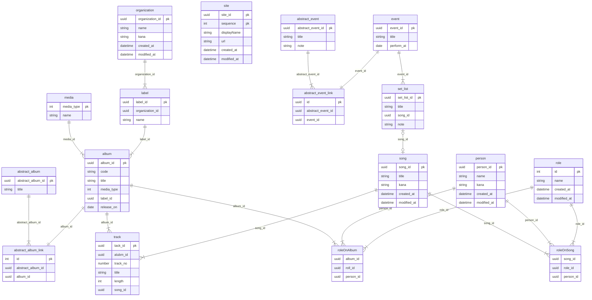

# DB設計のメモ

- 日付(date)の項目は末尾に _on
- 日時(datetime)の項目は末尾に _at
- 登録日時 created_at datetime
- 更新日時 modified_at datetime
- 名前 name verchar(256)
- カナ kana verchar(256) カタカナのみ

## 雑記

- データ登録
SQLServer ユニークIDの発番

<https://learn.microsoft.com/ja-jp/sql/t-sql/functions/newid-transact-sql?view=sql-server-ver16>

NEWID() 関数

## ダイアグラム

